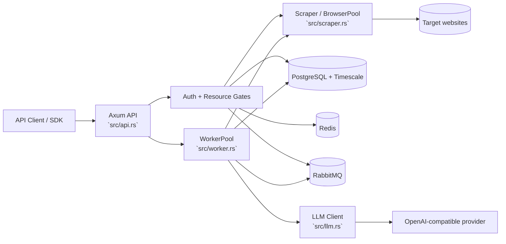

# fire_ctrl

Spec-compliant self-hosted Firecrawl in Rust


## Project status

- API target: Firecrawl-style `/v2/*` endpoints only.
- Runtime: server + worker in one binary (`fire_ctrl`).
- Infra model: local services, no Docker commands in this repo.

## Firecrawl v2 note

This codebase serves v2-prefixed endpoints (`/v2/...`) and does not expose legacy route prefixes.

## Architecture



## Features

- `/v2/scrape`, `/v2/crawl`, `/v2/batch/scrape`, `/v2/map`, `/v2/extract`, `/v2/search`, `/health`
- Markdown scraping (`formats: ["markdown"]`)
- Structured JSON scraping (`formats: ["json"]`)
- Combined output (`formats: ["markdown", "json"]`)
- Inline extraction warnings surfaced in `data.warning` for truncation or provider retries
- Crawl with robots.txt + sitemap support
- LLM extraction via OpenAI-compatible APIs (OpenAI, Groq, Ollama, etc.)
- PostgreSQL/Timescale-backed queue state

## Requirements

All dependencies are managed via Homebrew. Run `just install` to install and configure everything automatically.

| Dependency | Version | Purpose |
|---|---|---|
| `postgresql@17` | 17.x | Primary database and queue state storage |
| `timescaledb` | 2.x | TimescaleDB extension for PostgreSQL |
| `timescaledb-tools` | latest | TimescaleDB CLI utilities |
| `redis` | 8.x | Cache and rate limiting |
| `rabbitmq` | 4.x | Job queue message broker |
| `rust` | 1.93.x | Compiler and toolchain (pinned) |
| `just` | latest | Task runner |
| `jq` | latest | JSON output inspection |
| `hurl` | latest | HTTP benchmarking (`just bench`) |

### Notes

- PostgreSQL must have `shared_preload_libraries = 'timescaledb'` set in `postgresql.conf` and be restarted before the extension can be enabled. `just install` handles this automatically.
- `timescaledb` must be enabled per-database with `CREATE EXTENSION IF NOT EXISTS timescaledb CASCADE;`. `just install` runs this against the database declared in `.env`.
- `hurl` is only required for `just bench` and `just bench-scrape`.

The official Rust SDK crate (`firecrawl`, v2 client from upstream repo) is included as a dev dependency for compatibility testing.

## Quick start

Install all dependencies and configure the database in one step:

```bash
just install
```

`just install` installs all Homebrew packages, configures `shared_preload_libraries = 'timescaledb'` in `postgresql.conf`, starts all required services, creates the Postgres role and database from `.env`, and enables the TimescaleDB extension. It does not run migrations or build the binary.

If `.env` does not exist, `just install` will create it from `.env.example` and exit so you can fill in your credentials before re-running.

Once `just install` completes, run migrations and start the service:

```bash
just migrate
just start
```

To set up `.env` manually without running the full install:

```bash
cp .env.example .env
$EDITOR .env
```

Config is strict: the service fails fast if required env vars are missing.

## Rust toolchain controls

- `Cargo.toml` enforces `rust-version = "1.93"` for compilation.
- `rust-toolchain.toml` pins local toolchain selection to `1.93.0` and enables `rustfmt` + `clippy`.
- Verify your active compiler with:

```bash
rustc --version
```

If you use rustup and need to set the override manually:

```bash
rustup toolchain install 1.93.0 --component rustfmt --component clippy
rustup override set 1.93.0
```

## GitHub Actions policy

- Workflows are currently manual-only (`workflow_dispatch`) to avoid automatic billable runs.
- Run checks locally via `just check`, `just lint`, `just test`, and `just security`.

Health check:

```bash
curl -sS http://localhost:3002/health | jq
```

## Common commands

```bash
just run-all      # server + workers (dev)
just run-server   # server only
just run-worker   # workers only
just start        # release run
just stop         # stop running process

just check
just test
just contract-test
just api-suite-quotes
just api-test health
just lint
just fmt
just docs
just docs-open

just db-clean
just redis-clean
just rabbit-clean
just data-clean
```

`just contract-test` runs v2 SDK contract tests against a running local server.
`just api-suite-quotes` runs curl+jq endpoint smoke tests against `https://quotes.toscrape.com`.
Script entrypoint is `scripts/api-suite-quotes.sh` for direct execution.
Per-endpoint scripts live in `scripts/api-tests/` (for example `scripts/api-tests/crawl_status.sh`).

## Testing output formats

```bash
just scrape-markdown
just scrape-json
just scrape-both
```

For complete endpoint examples and payloads, see `docs/usage.md`.

Operational cleanup/recovery playbook is in `docs/ops.md`.
Manual CI policy and release checks are in `docs/ci.md`.
Architecture diagrams are in `docs/architecture.md`.

## Rustdoc instance

- Generate rustdoc locally: `just docs`
- Open rustdoc in a browser: `just docs-open`

## Endpoints

| Method | Path |
|---|---|
| GET | `/health` |
| POST | `/v2/scrape` |
| POST | `/v2/crawl` |
| GET | `/v2/crawl/:id` |
| DELETE | `/v2/crawl/:id` |
| GET | `/v2/crawl/:id/errors` |
| GET | `/v2/crawl/ongoing` |
| POST | `/v2/batch/scrape` |
| GET | `/v2/batch/scrape/:id` |
| DELETE | `/v2/batch/scrape/:id` |
| POST | `/v2/map` |
| POST | `/v2/extract` |
| GET | `/v2/extract/:id` |
| POST | `/v2/search` |

## Configuration

Use `.env.example` as the source of truth. Key variables:

- `HOST`, `PORT`
- `CORS_ALLOW_ORIGINS` (optional comma-separated browser origin allowlist)
- `POSTGRES_HOST`, `POSTGRES_PORT`, `POSTGRES_DB`, `POSTGRES_USER`, `POSTGRES_PASSWORD`
- `DATABASE_MAX_CONNECTIONS`
- `REDIS_URL`, `REDIS_RATE_LIMIT_URL`
- `NUQ_RABBITMQ_URL`
- `OPENAI_BASE_URL`, `MODEL_NAME`, `LLM_TIMEOUT_SECONDS`, `LLM_MAX_RETRIES`, `LLM_MAX_INPUT_CHARS`
- `OPENAI_API_KEY` (required unless using `OLLAMA_BASE_URL`)
- `NUM_WORKERS_PER_QUEUE`, `MAX_CONCURRENT_JOBS`, `WORKER_JOB_TIMEOUT_SECONDS`, `WORKER_MAX_STALLS`
- `CRAWLER_MAX_DEPTH`, `CRAWLER_MAX_PAGES`, `CRAWL_CONCURRENT_REQUESTS`, `CRAWLER_REQUEST_TIMEOUT_SECONDS`, `CRAWLER_USER_AGENT`, `CRAWLER_RESPECT_ROBOTS_TXT`, `BROWSER_POOL_SIZE`
- `USE_DB_AUTHENTICATION`, `TEST_API_KEY`, `BULL_AUTH_KEY`, `ALLOW_LOCAL_WEBHOOKS`
- `MAX_CPU`, `MAX_RAM`

## License

MIT
