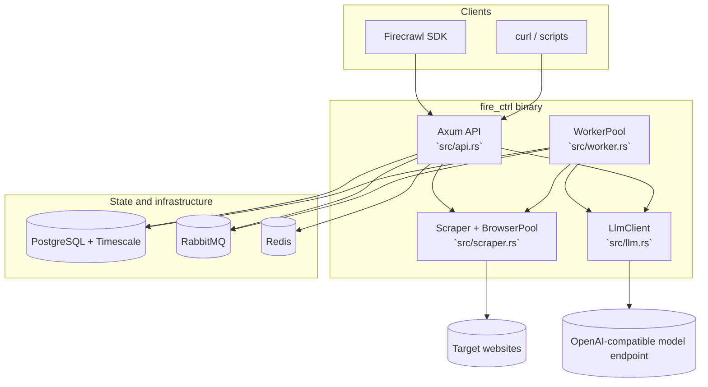
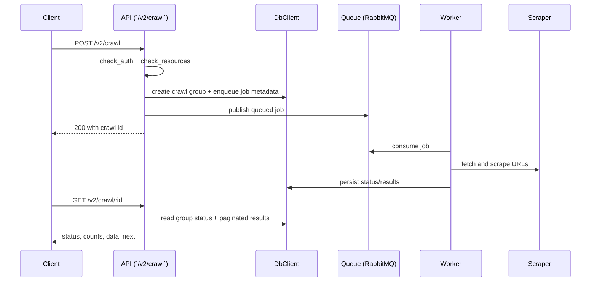

# Architecture

## High-level components

## Request lifecycle (`/v2/crawl`)

## Route coverage

- Synchronous routes: `/health`, `/v2/scrape`, `/v2/map`, `/v2/search`
- Async job routes: `/v2/crawl*`, `/v2/batch/scrape*`, `/v2/extract*`
- Auth gate applies when `USE_DB_AUTHENTICATION=true`
- Resource gate applies to heavier routes (`scrape`, `crawl`, `batch`, `search`)
